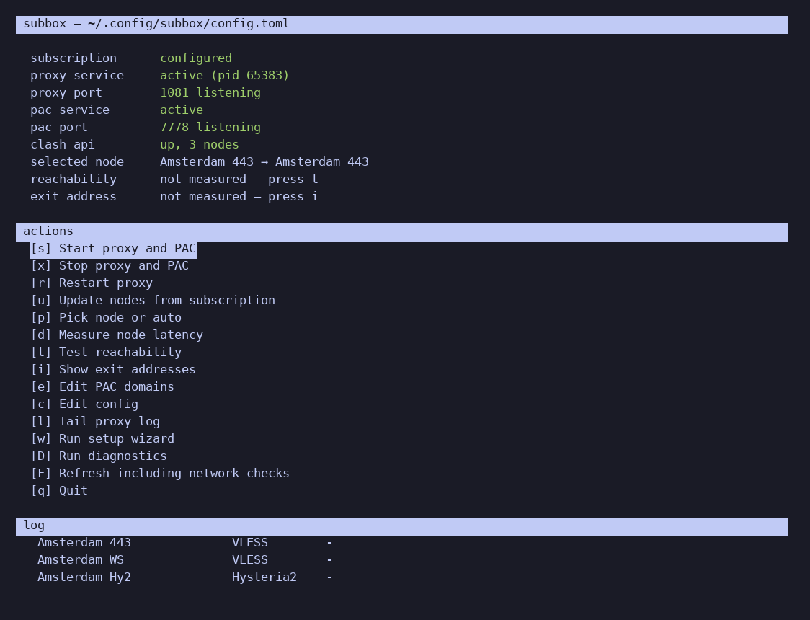

# subbox

Turn a proxy subscription into a running local proxy, with a terminal
dashboard to watch it and switch nodes.

Your panel gives you a subscription URL. `subbox` fetches it, turns the nodes
into a validated [sing-box](https://sing-box.sagernet.org/) configuration, runs
it as a systemd user service, and gives you a mixed HTTP/SOCKS5 proxy on
`127.0.0.1:1080`. Optionally it also serves a PAC file, so a browser sends only
the domains you choose through the proxy and everything else goes direct.



## What this is not

- **Not a VPN and not a TUN.** `subbox` listens on loopback. It does not
  capture system-wide traffic, because doing that needs `CAP_NET_ADMIN`, which
  a user service cannot be granted. Tools that do this well already exist.
- **Not a DPI bypass.** Changing which address your traffic comes out of, and
  defeating inspection of traffic in flight, are different problems.
  [zapret](https://github.com/bol-van/zapret) solves the second one.
- **Not a panel.** It consumes a subscription; it does not issue one.

## Requirements

- Linux with systemd
- Python 3.11 or newer
- The `sing-box` binary — the installer can fetch it for you

Nothing else. No `pip`, no build tooling, no Python packages: subbox is pure
standard library, and installing it copies files and writes a launcher.

## Install

On Arch:

```bash
yay -S subbox
subbox setup
```

Anywhere else:

```bash
git clone https://github.com/dYGamma/subbox
cd subbox
./install.sh
```

The installer checks the requirements, prints the exact package command for
your distribution if something is missing, and then runs the wizard. It never
calls `sudo` on your behalf.

Debian, Ubuntu, Fedora and openSUSE do not package `sing-box`. Either follow
the [official installation page](https://sing-box.sagernet.org/installation/),
or let the installer put the official static binary in your prefix, without
root:

```bash
./install.sh --fetch-sing-box
```

## First run

```console
$ subbox setup
subbox setup
Paste the subscription URL your panel gave you. It is a credential, so it is stored in a file only you can read.
Subscription URL from your panel: https://panel.example.com/sub/9f3c…
  found 3 node(s):
    Amsterdam 443                vless        198.51.100.10:443
    Amsterdam WS                 vless        198.51.100.10:8443
    Amsterdam Hy2                hysteria2    198.51.100.10:36712
Local proxy port [1080]:
Serve a PAC file so a browser routes only chosen domains? [Y/n]:
PAC server port [7777]:
Which domains should go through the proxy?
  1) AI assistants only (default)
  2) broader list (36 domains, includes social networks)
  3) enter your own
Choice [1]:
```

It fetches the subscription at the first question, so you see your own nodes
before answering anything else. Then it writes the configuration, starts the
services, and prints a diagnostic summary.

## Commands

| Command | What it does |
|---|---|
| `subbox` | Open the dashboard |
| `subbox setup` | Interactive configuration |
| `subbox sync` | Re-fetch the subscription, regenerate, restart |
| `subbox pac` | Regenerate the PAC file |
| `subbox status` | Report state; `--json` for scripts, `--quiet` for the exit code alone |
| `subbox doctor` | Diagnose problems and say how to fix them |

`status` exits `0` when the proxy is up, `1` when it is down, and `2` when
subbox is not configured yet. Scripts can rely on that.

## Dashboard

Pressing `subbox` with no arguments opens a dashboard showing which node is
carrying traffic, whether each service is up, and what your exit address is.
Keys: `u` re-sync from the subscription, `p` pick a node, `d` measure latency,
`t` test reachability, `D` run diagnostics, `q` quit.

## Configuration

`~/.config/subbox/config.toml`, created mode `0600` because the subscription
URL is a credential in its own right.

```toml
[subscription]
url = "https://panel.example.com/sub/9f3c"
insecure = false

[proxy]
listen_addr = "127.0.0.1"
listen_port = 1080
clash_port = 9090

[pac]
enabled = true
port = 7777
domains = ["anthropic.com", "claude.ai", "openai.com", "chatgpt.com"]

[probe]
reach_url = "https://www.gstatic.com/generate_204"
reach_ok = [204]
latency_url = "https://www.gstatic.com/generate_204"
```

The full commented reference is in `examples/config.toml`.

The generated sing-box configuration lands at
`~/.config/subbox/sing-box.json`, never over a `~/.config/sing-box/config.json`
you may have written yourself. It is regenerated from the subscription, so
edit `config.toml` and run `subbox sync` rather than editing it directly.

## Using the proxy

For a shell:

```bash
export HTTPS_PROXY=http://127.0.0.1:1080
export ALL_PROXY=socks5h://127.0.0.1:1080
```

For a browser, set the automatic proxy configuration URL to:

```console
http://127.0.0.1:7777/proxy.pac
```

Only the domains in `pac.domains` go through the proxy; everything else goes
direct.

## When something is wrong

```bash
subbox doctor
```

Every check names the symptom rather than only the setting, because
recognising the symptom is the hard part:

```console
[ok  ] Subscription configured: a subscription URL is set
[ok  ] Credential file permissions: 3 file(s) are 0600
[ok  ] route.auto_detect_interface: correctly false
[ok  ] route.default_domain_resolver: set
[ok  ] Cache directory: /home/you/.cache/subbox
[FAIL] Reachability: direct 204, via proxy 403 — the tunnel carries traffic but the exit address is rejected by this endpoint
         fix: switch to another node with `subbox` and press p
```

`docs/troubleshooting.md` covers each failure in more detail.

## Removing it

```bash
cd subbox && make uninstall
```

That stops and disables the services and removes everything the install put
in place. Your configuration and generated files are left alone; delete them
yourself if you want them gone:

```bash
rm -rf ~/.config/subbox ~/.local/share/subbox ~/.cache/subbox
```

The optional Claude Code integration is separate, because it lives among files
subbox did not put there:

```bash
make uninstall-claude
```

## Documentation

- [`docs/setup.md`](docs/setup.md) — step by step, from your panel to a working proxy
- [`docs/troubleshooting.md`](docs/troubleshooting.md) — symptom, cause, fix
- [`docs/architecture.md`](docs/architecture.md) — how the pieces fit, for contributors
- [`integrations/claude-code/`](integrations/claude-code/) — optional Claude Code wrapper

[Русская версия](README.ru.md).

## Licence

MIT.
